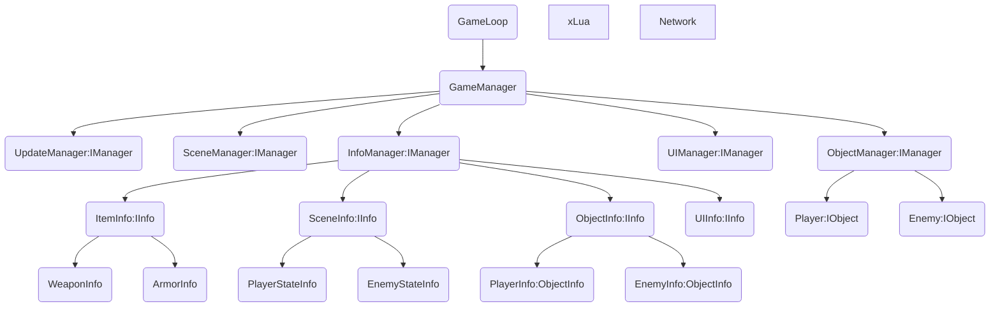
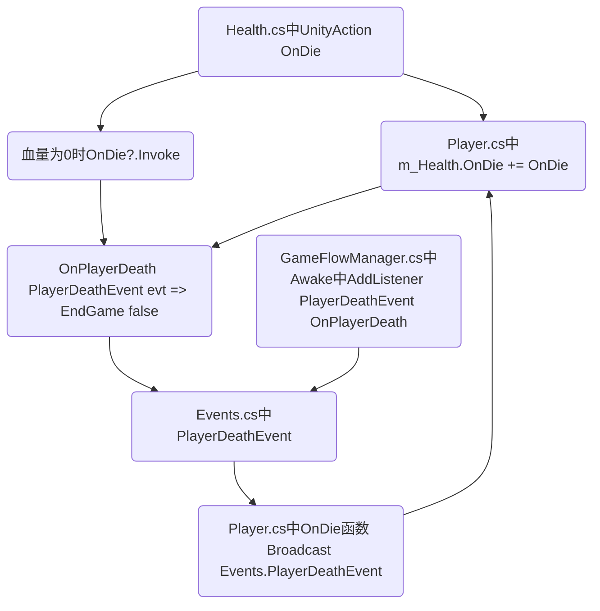

# Re-TouchGunFire

Rebuild project.

## TODO

AB包加载区分(编辑器模式,发布模式)

## 已知问题

## CHANGELOG

> `22.10.18 12:34`
Renamed Mediation to Mediator. 
add EventMgr System. 
UIMgr - PushPanel function fixed. 

> `22.10.17 22:02`
Google.Protobuf problem fixed. 
**First Time For Build Successful.**

> `22.10.17 4:13`
improved AbMediator, SceneMediator, GameLoop etc. 

> `22.10.16 23:49`
add PanelMediator. 
work in progress for InitScene. 

> `22.10.15 23:41`
rewrite something. 
add HotUpdateMediator. 

> `22.10.15 7:10`
add CanvasMediator, LuaMediator, NetworkMediator etc. 
rewrite some enum, GameManager etc. 
add CanvasInfo, RegisterPanelInfo etc. 
add plugin "AssetBundleBrowserPlus". 

> `22.10.14 17:28`
add Mediator Mode , IMediator. 
rewrite Interface. 

> `22.10.13 23:41`
add RequestMgr, IRequest. 

> `22.10.11 22:41`
add XLua, SocketClient etc. 

> `Init / 22.9.24`
null

## 项目结构

## 临时运行流程指导示意图
