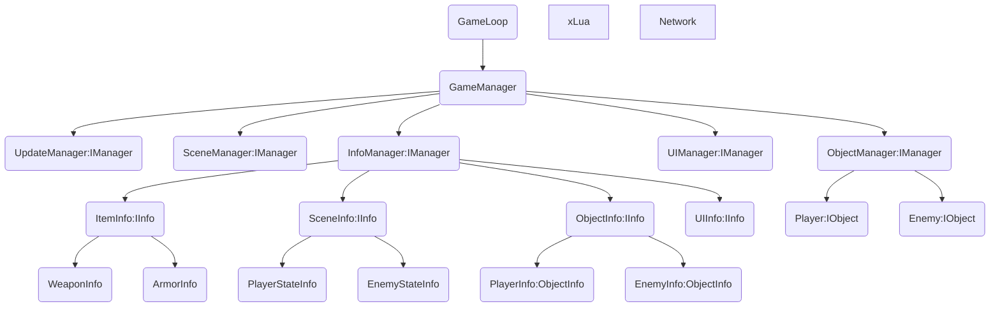
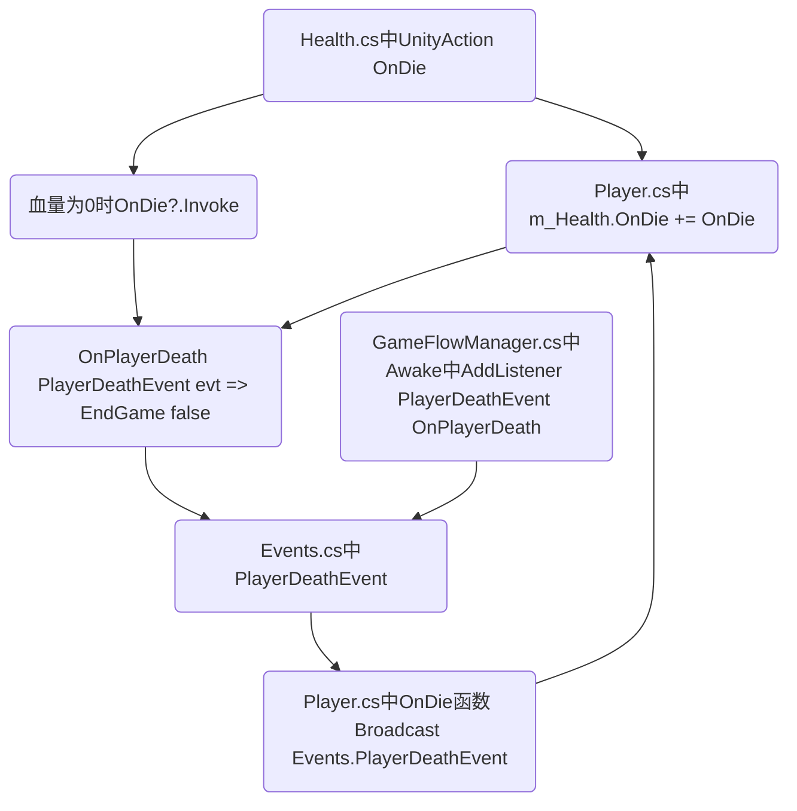

# Re-TouchGunFire

Rebuild project.

## TODO

Pop/Push改为对Panel下的Point进行操作

登陆UI搭建

战斗场景为伪3d悬浮平台

## 已知问题

似乎多个资源异步加载时会触发如果AB包没及时卸载就再次尝试加载的Error
- The AssetBundle 'D:/Source/Re-TouchGunFire/Assets/StreamingAssets/AbMap/AssetBundle/prefabs' can't be loaded because another AssetBundle with the same files is already loaded.

- Error while getting Asset Bundle: The AssetBundle 'D:/Source/Re-TouchGunFire/Assets/StreamingAssets/AbMap/AssetBundle/prefabs' can't be loaded because another AssetBundle with the same files is already loaded.

- NullReferenceException: Object reference not set to an instance of an object
ReTouchGunFire.Mediators.AbMediator+<AsyncLoadABRes>d__9.MoveNext () (at Assets/Scripts/Mediators/AbMediator.cs:150)

## CHANGELOG

> `22.10.23 2:43`
add PlayerInfoPanelInfo, PlayerPropsPanelInfo. 

> `22.10.22 11.21`
modify for old UI panel. 

> `22.10.22 1:35`
new UI: PlayerInfoPanel, PlayerPropsPanel. 

> `22.10.21 0:12`
add MainMenuPanel. 

> `22.10.19 22:11`
add BackButtonPanel. 

> `22.10.19 5:32`
因为异步加载问题 全部加载资源方式换成同步加载. 
add MainInfoPanel etc. 

> `22.10.18 12:34`
Renamed Mediation to Mediator. 
add EventMgr System. 
UIMgr - PushPanel function fixed. 

> `22.10.17 22:02`
Google.Protobuf problem fixed. 
**First Time For Build Successful.**

> `22.10.17 4:13`
improved AbMediator, SceneMediator, GameLoop etc. 

> `22.10.16 23:49`
add PanelMediator. 
work in progress for InitScene. 

> `22.10.15 23:41`
rewrite something. 
add HotUpdateMediator. 

> `22.10.15 7:10`
add CanvasMediator, LuaMediator, NetworkMediator etc. 
rewrite some enum, GameManager etc. 
add CanvasInfo, RegisterPanelInfo etc. 
add plugin "AssetBundleBrowserPlus". 

> `22.10.14 17:28`
add Mediator Mode , IMediator. 
rewrite Interface. 

> `22.10.13 23:41`
add RequestMgr, IRequest. 

> `22.10.11 22:41`
add XLua, SocketClient etc. 

> `Init / 22.9.24`
null

## 项目结构

## 临时运行流程指导示意图
