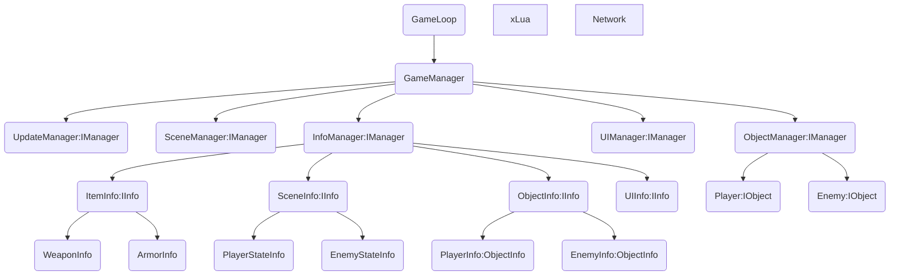
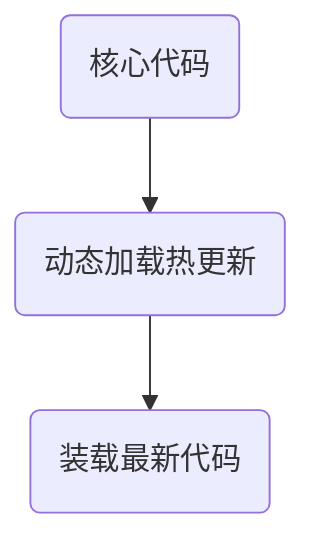

# Re-TouchGunFire

Rebuild project.

## 项目结构

```mermaid
graph TB
gl(GameLoop)
gm(GameManager)
upm(UpdateManager:IManager)
sm(SceneManager:IManager)
im(InfoManager:IManager)
um(UIManager:IManager)
om(ObjectManager:IManager)
ii:ii(ItemInfo:IInfo)
oi:ii(ObjectInfo:IInfo)
si:ii(StateInfo:IInfo)
wi:ii(WeaponInfo)
pi:oi(PlayerInfo:ObjectInfo)
ei:oi(EnemyInfo:ObjectInfo)
p:io(Player:IObject)
e:io(Enemy:IObject)
si:ii(SceneInfo:IInfo)
psi:si(PlayerStateInfo)
esi:si(EnemyStateInfo)
ai:ii(ArmorInfo)
ui:ii(UIInfo:IInfo)
xLua
Network
gl-->gm
gm-->upm
gm-->sm
gm-->im
gm-->um
gm-->om
im-->ii:ii
im-->si:ii
im-->oi:ii
im-->ui:ii
oi:ii-->pi:oi
ii:ii-->wi:ii
oi:ii-->ei:oi
ii:ii-->ai:ii
om-->p:io
om-->e:io
si:ii-->psi:si
si:ii-->esi:si
```
## 运行流程(指导意义)

```mermaid
graph TB

a(核心代码)
b(动态加载热更新)
c(装载最新代码)
a-->b
b-->c
```