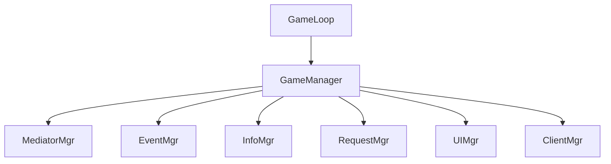
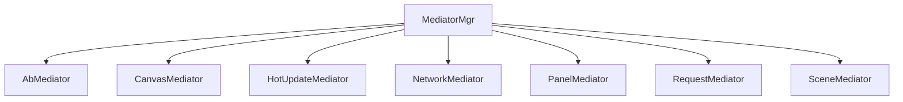
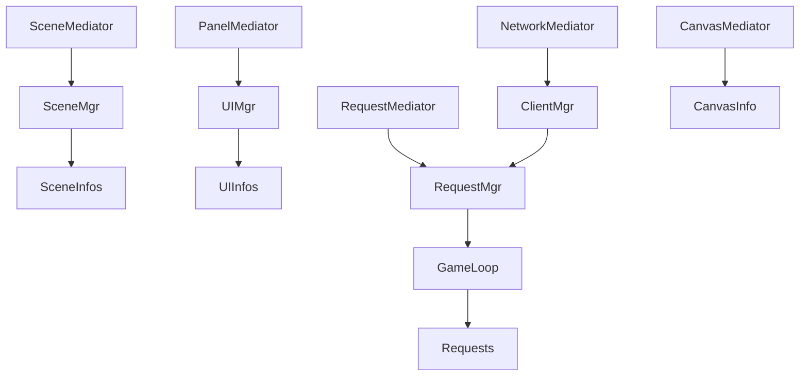
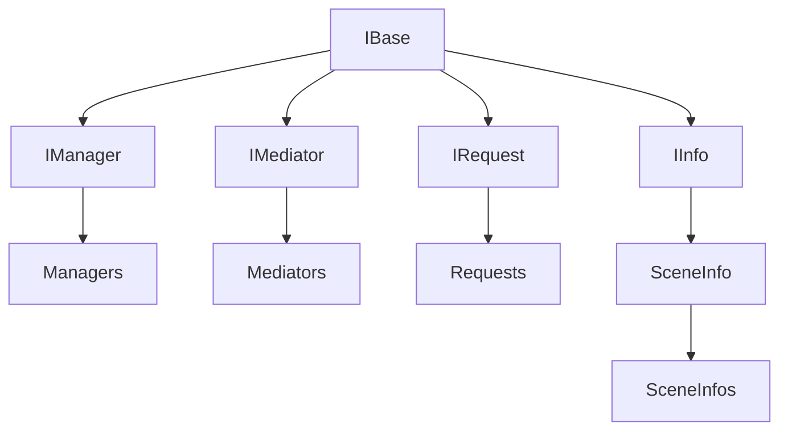
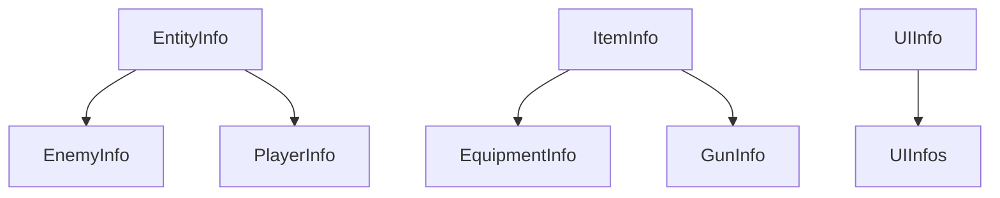
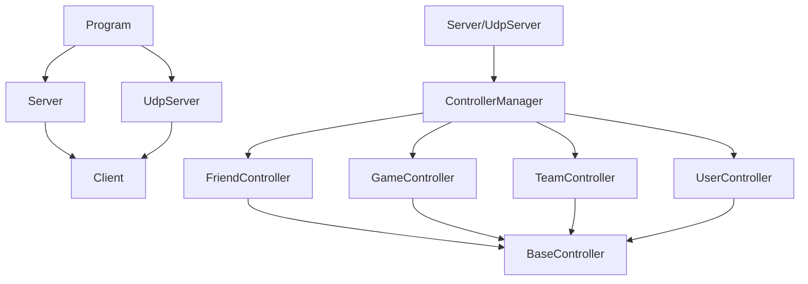
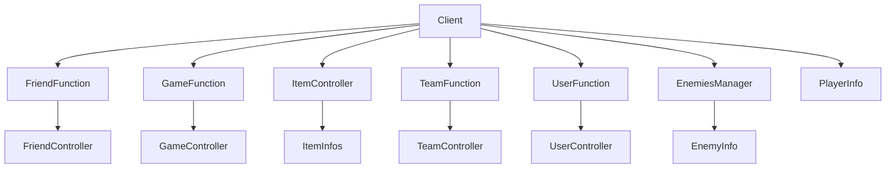

# Re-TouchGunFire

Rebuild project.

**2022.12.17项目基本结束开发**

[视频](https://www.acfun.cn/player/ac40190066)

### TODO

玩家生命值为0时死亡,如果处在联机状态下则需要通过其他队员对死亡队员信息长按10秒进行救援,单人情况下死亡直接关卡失败,返回主界面,生命值护甲值直接全满

关卡结束时全部玩家恢复满血满甲

服务端PlayerSpawn用于玩家复活 

bug:单人开局后死亡后 准备就绪失败

### OPTIONAL TODO

新增武器/装备的自带一些副词条中存在的属性(成员变量已添加,但未赋值). 

---
## Client项目结构

---
## Server项目结构

## CHANGELOG

> `23.7.30 `
Server:实现当玩家攻击敌人的同时还对玩家造成伤害

> `22.12.17 13:45`
~~Server(Bug):一段时间后数据库会关闭~~ 
~~Client(Bug):单人出击时选择离开战斗,出击按钮会变为准备就绪~~

> `22.12.17 0:32`
Server:玩家断开时先保存进数据库再置空该client. 
Client/Server:怪物被击杀获取经验值和金币,随机获取一定量弹药. 
~~Client(Bug)?是否修复未知:有时小队员退队会导致队友状态条未正确删除~~ 

> `22.12.16 12:07`
Server:在小队内且正在战斗时,队长选择离开战斗会使全队一起离开战斗. 
Server:在小队内且正在战斗时,队员离开小队或独自离开将会直接独自离开战斗. 
~~Server(Bug):战斗中队员离开时,队友血条未正确删除~~ 

> `22.12.15 22:30`
Client/Server:在小队内时,只有小队长才能发起出击邀请,小队长出击时将检查其他小队成员的准备状态,全部为准备就绪状态时,小队长才可以出击,若小队长想要出击时其他队友未能准备就绪,则可以发送提示告知其他未准备的小队成员. 
~~Client(Bug):准备就绪按钮的变化还不正确~~ 
~~Client(Bug):队员全都准备时出击按钮功能没有从提醒队友变成出击请求~~ 
Client:出击和大厅场景切换时队友状态栏的Level变化. 
Client:出击后隐藏主菜单的出击按钮. 
~~Client(Bug):出击后队友列表还在显示已准备~~ 
~~Client(Bug):队长出击后出击按钮会变成准备按钮~~ 

> `22.12.15 3:58`
Client:在玩家自身为小队成员而非队长时,主界面的出击按钮替换为准备按钮 
~~Client(Bug):创建小队时连队长都会显示准备就绪~~ 
Client:Add AttackInvitedRequest(实行队长发起出击后同步进入战斗场景的作用). 
Client:add ReadyAttackRequest, CancelReadyAttackRequest, TeamMasterAttackNotifyRequest. 

> `22.12.13 23:16`
Client:伤害跳字颜色区分. 
Server:优化计算伤害函数. 
Server:战斗结束. 
add AttackEndRequest. 

> `22.12.13 4:39`
Client/Server:击杀敌人时清理实例. 
add BeatEnemyRequest. 
~~Server(Bug):穿透伤害未正确计算~~ 
~~Client(Bug):每次出击时,都会让伤害判定错误地增加1次~~ 
~~Client(Bug):备弹数会错误地低于0~~ 
~~Server(Bug):玩家脱离战斗时重置EnemiesManager(需要用函数重新实例化新的Enemy)~~ 

> `22.12.12 22:58`
Client:请求返回弹出击中伤害数字. 
add DamageTextInfo. 

> `22.12.12 6:03`
Server/Client:点击中敌人时发送请求

> `22.12.11 8:48`
Server/Client:怪物信息与EnemyInfo在服务器与客户端之间同步
Client:根据Server保存的EnemyInfo中的位置等信息在Client处对应位置生成Enemy
add HitRegRequest 30%. 

> `22.12.11 1:00`
add AttackLeaveRequest, UpdateAttackingInfoRequest. 
Server/Client:玩家离开战斗请求. 
Server/Client:玩家单人发起出击请求,服务器返回成功并生成怪物信息. 
Server:EnemiesManager 70%. 

> `22.12.10 11:48`
Server:EnemiesManager 50%. a lot of Function. 
add StartAttackRequest, AttackInviteRequest. 

> `22.12.9 5:00`
add FloorTemplateInfo, EFloor, EFloorPos. 
Client/UI:怪物信息与EnemyInfo

> `22.12.7 3:45`
~~Client(Bug):不要让点击鼠标时就射击~~
Client:删除隐藏属性按钮
Client:武器装弹按钮
~~Client(Bug):射线hit两个敌人时会多次消耗子弹~~

> `22.12.6 4:17`
~~Client(Bug):商店栏为正常穿戴的装备显示高亮~~
Client/Server:武器类需要ReloadingTime
穿戴的装备同步信息到武器栏和属性栏的武器部分

> `22.12.6 0:03`
~~Client(Bug):穿戴装备时会导致同时Use为false.~~
~~Server(Bug):装备刷新副词条失败.~~
~~Client(Bug):装备ButtonList不应有刷新主词条.~~
~~Client(Bug):全部解锁副词条的装备不再显示解锁新词条.~~
~~Server(Bug):SubProp123Type未同步到Pack.~~
~~Server(Bug):下线时server的ItemInfo 的Use未同步至数据库.~~
~~Server(Bug):玩家上线时根据装备Use首次进行一次穿戴.~~
~~Server(Bug):从数据库获取主副词条时没有给ItemInfo赋值.~~

> `22.12.5 1:03`
ShopPanelInfo 98% -> 99%. 
server: Debug work in progress.

> `22.12.4 2:04`
add ShopPanelBaseRequest,
ShopPanelInfo 93% -> 98% ?

> `22.12.3 3:39`
add UnlockItemSubPropRequestRequest, RefreshItemSubPropRequestRequest, RefreshGunCorePropRequestRequest. 

> `22.12.2 1:36`
server/client: rebuild ItemSystem. 
add EquipItemRequest. 

> `22.12.1 19:37`
server: equipment and gun equip finish.

> `22.11.30 19:29`
add ShoppingRequest, GetItemInfoRequest. 
ShopPanelInfo 85% -> 93%. 

> `22.11.29 20:26`
protobuf buffer bug fixed. 

> `22.11.29 1:41`
ShopPanelInfo 85%. 

> `22.11.28 0:52`
ShopPanelInfo 80%. 

> `22.11.27 18:18`
add ItemBarInfo. 
ShopPanelInfo 70%. 
PlayerInfo finished. 

> `22.11.26 22:21`
panelInfo: public -> SerializeField
PlayerInfo 80%. 

> `22.11.26 21:32`
ShopPanel finished. 
add ShopPanelInfo. 

> `22.11.25 17:23`
add ShopPanel 70%. 

> `22.11.24 18:29`
server work done. 
client some modify to be ready to work for Backpack System. 

> `22.11.23 20:47`
some changed. 

> `22.11.22 22:59`
item system work in progress. 

> `22.11.21 18:15`
something changed. 

> `22.11.21 3:00`
add RegenerationRequest. 

> `22.11.19 14:59`
add KickPlayerRequest. 

> `22.11.18 22:19`
request finished. 

> `22.11.18 17:42`
add AcceptedJoinTeamRequest, RefusedJoinTeamRequest, RefuseJoinTeamRequest. 
a lot of modify.

> `22.11.17 21:56`
add AcceptJoinTeamRequest, PlayerJoinTeamRequest. 

> `22.11.17 15:01`
rebuild request callback. 

> `22.11.16 18:09`
UpdatePlayerInfoRequest done. 
something need fix. 

> `22.11.15 22:51`
add UpdatePlayerInfoRequest. 
some modify. 

> `22.11.14 16:27`
add BreakTeamRequest, TeammateLeaveTeamRequest. 
bug fixed. 

> `22.11.13 22:11`
add LeaveTeamRequest 90%. 

> `22.11.13 13:00`
FriendsPanelInfo, FriendPlayerInfoBarInfo, LoginRegisterPanelInfo modify. 

> `22.11.12 21:36`
GetTeammatesRequest Finished. 
bug fixed. 

> `22.11.11 18:03`
Finish AcceptInviteTeamRequest, AcceptedInviteTeamRequest, RefuseInviteTeamRequest, RefusedInviteTeamRequest. 

> `22.11.10 19:37`
add AcceptInviteTeamRequest 20%, AcceptedInviteTeamRequest 20%, InvitedTeamRequest, InviteTeamRequest, JoinTeamRequestRequest 30%, RefuseInviteTeamRequest 50%. 
add PartyCurrentStatePanelInfo, TeammateBarInfo. 
add PartyCurrentStatePanel, TeammateBar. 

> `22.11.9 20:00`
modify some UI and UIInfo. 
Requests something changed. 

> `22.11.9 14:21`
rebuild request: add RequestMediator. 
add AcceptFriendRequestRequest, DeleteFriendRequest, RefuseFriendRequestRequest. 

> `22.11.8 19:18`
add GetPlayerBaseInfoRequest. 
FriendsPanelInfo 75%. 

> `22.11.8 12:38`
SearchFriendRequest finished.
FriendsPanelInfo 65%.

> `22.11.7 18:37`
add GetFriendRequestRequest 50%, GetFriendsRequest 50%, SearchFriendRequest 50%, SendRequestFriendRequest. 
FriendsPanelInfo 60%. 

> `22.11.7 12:19`
add FriendsPanelInfo 50%. 

> `22.11.6 20:18`
add FriendsPanel. 

> `22.11.6 12:39`
add Loom, add Udp support.
redesign ui size.

> `22.11.5 17:57`
add InitPlayerInfoRequest. 
implement user login/register/init info. 

> `22.11.1 8:13`
basically implement register function. 
something modify. 

> `22.11.1 4:51`
basically implement login function. 

> `22.10.31 7:42`
add NotifyPanel and NotifyPanelInfo. 
AbMediator fixed. 
GameLoop change: now there's only one scene. 

> `22.10.30 15:46`
add LoginRegisterPanel, LoginRegisterPanelInfo. 

> `22.10.30 3:09`
basically implement player shooting and enemy hit. (raycast hit)

> `22.10.29 6:07`
add TwiceConfirmPanel and TwiceConfirmPanelInfo. 

> `22.10.28 9:18`
add PlayerCurrentStatePanel. 

> `22.10.28 2:51`
panel level logic modified. 

> `22.10.27 13:05`
panel restore. 

> `22.10.27 9:28`
add BattleLittleMenuPanelInfo, BattleLittleMenuPanel. 

> `22.10.27 2:53`
add BattleGunInfoPanelInfo, BattleGunInfoPanel. 

> `22.10.26 3:27`
add AttackArea1PanelInfo, BaseAttackAreaPanelInfo, LoadingPanelInfo. 
add AttackArea1Panel, LoadingPanel. 
something modify. 

> `22.10.25 11:59`
add BackpackPanelInfo. 

> `22.10.25 4:08`
add Equipment, Gun props. 

> `22.10.24 12:23`
改了变量名

> `22.10.23 19:03`
add TestPanel, TestPanelInfo, fix bug and rewrite panelMediator, UIMgr. 

> `22.10.23 2:43`
add PlayerInfoPanelInfo, PlayerPropsPanelInfo. 

> `22.10.22 11.21`
modify for old UI panel. 

> `22.10.22 1:35`
new UI: PlayerInfoPanel, PlayerPropsPanel. 

> `22.10.21 0:12`
add MainMenuPanel. 

> `22.10.19 22:11`
add BackButtonPanel. 

> `22.10.19 5:32`
因为异步加载问题 全部加载资源方式换成同步加载. 
add MainInfoPanel etc. 

> `22.10.18 12:34`
Renamed Mediation to Mediator. 
add EventMgr System. 
UIMgr - PushPanel function fixed. 

> `22.10.17 22:02`
Google.Protobuf problem fixed. 
**First Time For Build Successful.**

> `22.10.17 4:13`
improved AbMediator, SceneMediator, GameLoop etc. 

> `22.10.16 23:49`
add PanelMediator. 
work in progress for InitScene. 

> `22.10.15 23:41`
rewrite something. 
add HotUpdateMediator. 

> `22.10.15 7:10`
add CanvasMediator, LuaMediator, NetworkMediator etc. 
rewrite some enum, GameManager etc. 
add CanvasInfo, RegisterPanelInfo etc. 
add plugin "AssetBundleBrowserPlus". 

> `22.10.14 17:28`
add Mediator Mode , IMediator. 
rewrite Interface. 

> `22.10.13 23:41`
add RequestMgr, IRequest. 

> `22.10.11 22:41`
**项目正式启动** 
add XLua, SocketClient etc. 

> `Init / 22.9.24`
null

